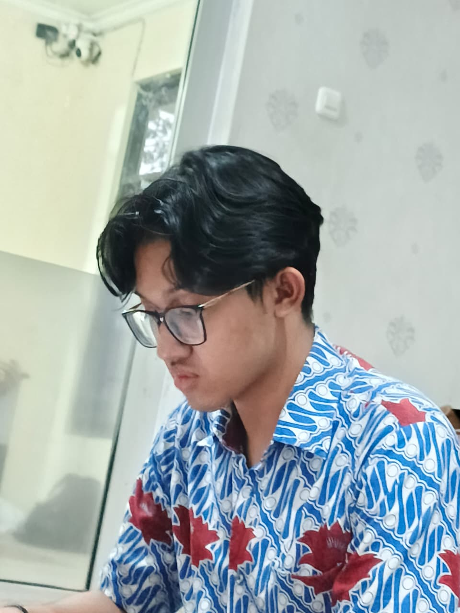

# 👁️ MATAAPA — Sebuah Teka-Teki

> *"Yang terlihat belum tentu nyata. Yang tersembunyi belum tentu tak ada."*
---
## Selamat Datang, Pencari

Kamu menemukan ini karena satu alasan: **rasa penasaranmu lebih kuat daripada rasa malasmu.**

Di dalam repositori ini tersebar **500 keping fragmen**. Sebagian besar hanyalah kebisingan — pengalih perhatian yang sengaja ditaburkan supaya kamu lelah sebelum sampai ke inti. Tapi di antara kebisingan itu, ada **satu kata** yang muncul jauh lebih jarang dari yang lain.

Kata itu hanya muncul **dua kali**. Tidak lebih, tidak kurang.

Kalau kamu tahu bahasa mesin, kamu akan mengenalinya. Kalau tidak — mungkin sudah saatnya belajar membaca **0 dan 1**.

---

## Petunjuk #1 — Bahasa yang Tersembunyi

Semua fragmen ditulis dalam bahasa yang sama: hanya dua simbol, tanpa spasi, tanpa jeda.

```
0101001101100101011011100110000101001100011011110111011001100101011100110100110101100001011000100110100101101110
```

---

## Petunjuk #2 — Tidak Semua yang Terlihat Adalah Wajahnya

Sebuah gambar tidak selalu hanya berisi piksel.

Kadang, sesuatu yang lain menumpang di dalamnya — diam, menunggu, tidak terlihat oleh mata biasa, tapi bisa "dibuka" oleh alat yang tepat. Coba pikirkan: apa yang terjadi kalau kamu menggabungkan dua hal yang seharusnya tidak pernah digabung?

*Petunjuk kecil: alat kompresi favoritmu mungkin bisa melihat lebih jauh dari sekadar melihat.*

---

## Petunjuk #3 — Divisi yang Tersembunyi

Ada sebuah nama yang muncul berulang kali di antara file-file ini. Nama itu bukan kebetulan. Ia adalah gerbang, bukan tujuan.

Ikuti namanya. Cari isinya. Lihat apa yang ada di baliknya.

---

## Peringatan

Kalau kamu menyerah di sini, aku sudah bisa membayangkan apa yang akan terjadi:

> **"Kalau Gabisa Nemu Nanti Diejek Fakhri sama Kaysan Loh"**
<br>
> **"398 file di luar sana hanya akan menertawakanmu ("Hehe Salah ;)""**

Kamu akan menemukan kalimat itu berkali-kali sepanjang perjalananmu. Anggap saja itu motivasi. Atau ejekan. Terserah kamu memaknainya seperti apa.

Oh ya, BTW cari link yang dibutuhin diMahaKaryaSuperDasyat, Buat Activate Accountnya di Ada Lovelace yah (Clue Pertama Dari Kadiv)

---

## Aturan Main

1. Setiap fragmen punya makna — atau tidak punya makna sama sekali. Kamu yang harus membedakannya.
2. Kata kunci yang kamu cari hanya muncul **dua kali** di seluruh koleksi ini. Temukan keduanya, dan kamu akan tahu langkah berikutnya.
3. Yang tersembunyi di dalam bukanlah akhir — ia hanyalah pintu berikutnya.

---

<p align="center"><i>Selamat mencari. Selamat tersesat. Selamat menemukan.</i></p>
<p align="center">
  
</p>
